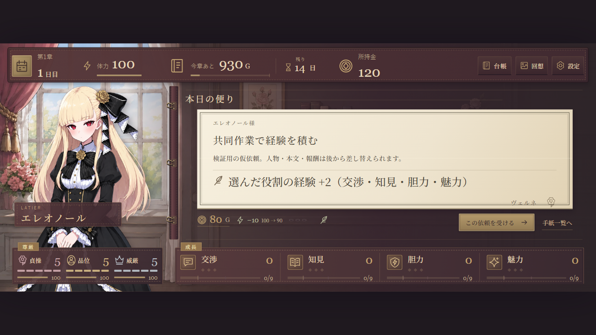
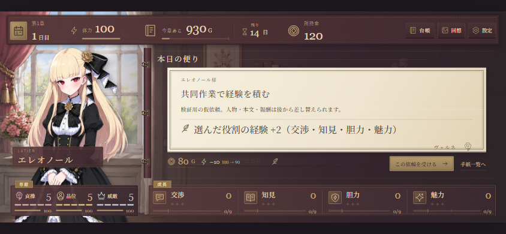
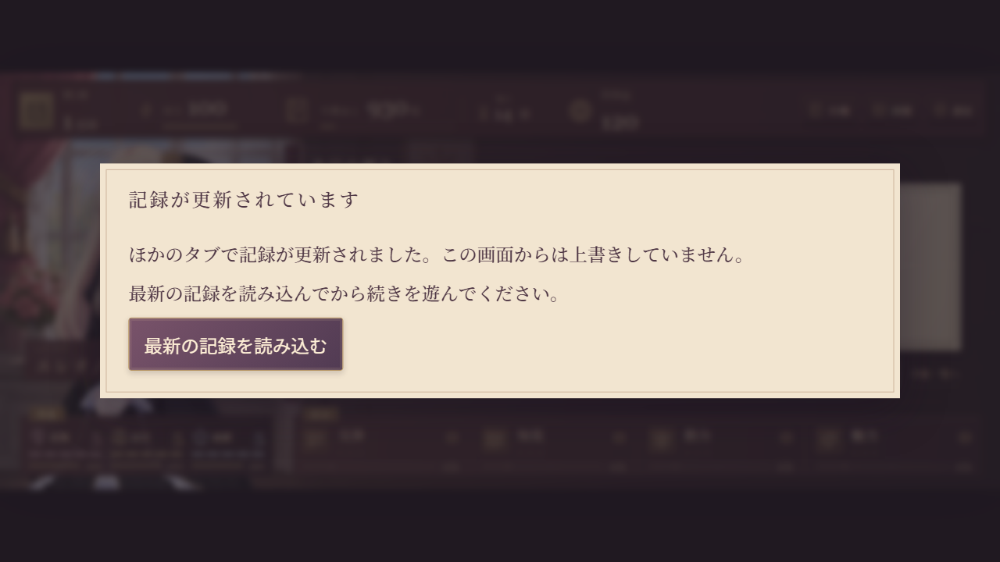
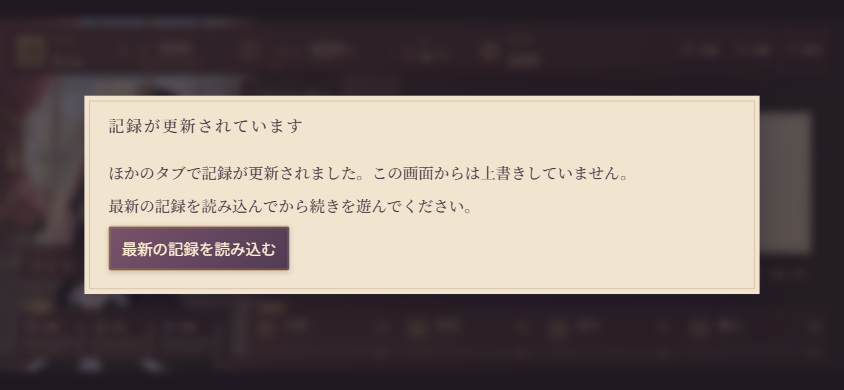

# 保存と販売前レビュー指摘の修正記録

2026-09-11。対象は `f69b8f84` からの `fix/save-and-review-followups` の差分。今回の依頼は、仕様決定を要しない修正。公開版の配信操作は含まない。

## 変更と確認

- **保存競合**：開始・ADV・本文位置・既視依頼・休息・精算・削除・再試行を共通の保存窓口へ接続。排他区間で保存元の全文を照合し、別タブが更新した場合は書き込まず、再読み込みへ案内する。Web Locksの未対応環境ではIndexedDBのreadwriteトランザクションで排他する。v16の保存データと旧版移行を維持した。
- **テスト**：旧回想の試験は旧依頼で検証し、表示用フィクスチャは31件の依頼を扱う。本番の提示優先度を変えず、ADVの試験で確認する。
- **シミュレーション**：本編と同じ受諾・本文遷移・条件付き選択・終了・章末精算を通す。成長、選択報酬、関係、後続フラグを収支に反映する。ゲームの数値は変更していない。
- **依頼詳細**：既存の `growthHint` を、受諾前の便箋に表示。紙と羽根ペンの既存意匠を使う。
- **返済表示**：「返済残」から「今章あと」「今章確保済」へ修正し、G単位と読み上げ説明を付けた。初期930Gは借金総額ではなく今章の不足額。
- **説明書**：READMEと制作ガイドを現在の開始ボタンへ合わせ、試験の起動方法と保存競合の扱いを追記。旧調剤時代の収支を現行値として説明するコメントを削除した。

## 試験結果

| 確認 | 結果 |
|---|---|
| `npm run build` | 型検査・配信用ビルド成功 |
| `npm test` | 日次14、旧目録9、本文・既読、ADV28、保存4、シミュレーションの確認が成功 |
| `npm run test:ui` | 31依頼・57提示、受諾不可3件、成長ヒントの欠け、精算・再開・本文表示を確認 |
| `npm run test:adv-ui` | 成長・分岐・途中再開・二重適用防止・回想・保存容量不足からの再試行が成功 |
| `npm run test:save-ui` | Chromiumで2タブの日送り・精算・同時開始・再読み込みを確認。Web LocksとIndexedDB代替の両方で成功。排他処理の失敗後も保存を書き換えず、再試行できた |
| `npm run sim` | 3方針×24周が6章を完了。収支の整合は別途シミュレーション試験で確認 |

### 現行仮データの比較

| 方針（既知の効果を評価する貪欲選択） | 第1章の平均収入 | 最終平均残債 |
|---|---:|---:|
| 収入優先 | 1,549G | 3,078G |
| 育成・後続依頼優先 | 1,468G | 1,308G |
| 尊厳維持・関係優先 | 1,604G | 0G |

関係を重視した方針で完済する経路を確認できた。最適解探索・初見プレイヤーの再現・難易度の妥当性の判定ではない。選択を飛ばす旧シミュレーションの残債7,575Gは、現行本編の判定根拠から外す。本番コンテンツ確定後に再測定と外部プレイ確認が必要。

## UIの簡易確認記録

[UI品質確認記録の書式](UI_REVIEW_TEMPLATE.md)の簡易記録を適用。

- 変更画面・版：依頼詳細、HUDの章内不足額、保存競合の案内。本記録と同じ差分。固定1200×500、成長4項目と尊厳3軸の配置を維持。
- 画像と目視：下記4枚を1280×720と844×390で確認。V01の人物・便箋の構図、V02の紙・墨・羽根ペンを維持。V03/V06は成長の見通しと返済額の意味を改善。V04の保存案内は閉じるだけの無効な操作を置かず、再読込へ進む。V05は既存の開封→受諾→ADVの経路を試験で確認。商業美術の完成判定はしない。
- 測定：成長ヒントは実効約23.47px／15.47px。本文領域からの欠けなし。保存案内は画面内に収まり、追加本文は22px（844幅で約15.47px）、復帰ボタンは論理64px以上（同約45px以上）。既存HUDの小文字・受諾ボタンなど、画面全体の小画面可読性は残件。
- 環境：Windows上のPlaywright Chromium、模擬ビューポート、動きを減らす設定。通常速度の全演出、Safari／Firefox、iPhone／Android実機、販売先iframe、全文量での性能は今回未確認。既存画面の全巡回は実施していない。

## 残件と適用範囲

今回の保存保護は更新後のコードを使う同一配信元・同一ブラウザーのタブ間が対象。古いコードを開き続けているタブにも反映するには再読み込みが必要。保存形式の変更・セーブ書き出し・クラウド同期・回想容量の最適化は別作業。発売タスク上、T04は実装済み、T03はテスト修正済みでCIは残る。T10は現行仮データ向けに実装済み、T14は既存ヒントとHUDを修正済みだが本番量での確認は残る。

本番の物語・結末・素材、返済バランス、販売方式と購入導線、保証端末、セーブ持ち運びを完成させる必要がある。今回の対象修正の完了を、ゲーム全体の出荷判定に置き換えない。GitHub Pagesへの公開は未実施。
